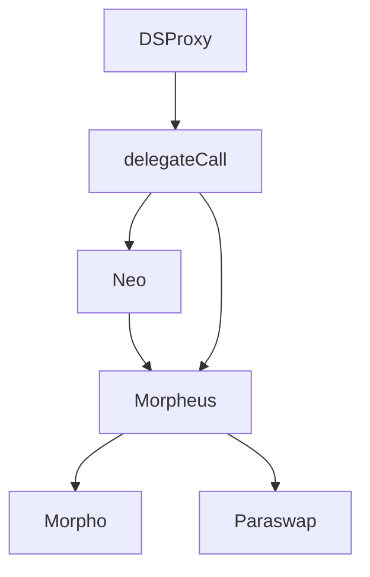

 

 Get out of the Matrix and Leverage your positions using Morpho.

# How it works ?

Morphous gives back the power of flash loans to the people. Each user can access a variety of ways to leverage its position and maximise its rewards.

# Three main components

* `Neo`: Flashloan router. DSProxy delegatecall to this contract in order to take a floashloan.
* `BalancerFL`:  Flashloan Recipient. Transfers the flashloaned tokens to DSProxy and execute through Morpheus actions.
* `Morpheus`: Main router that enables to uses Morpho and Paraswap through DSProxy.