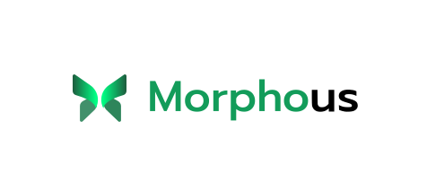
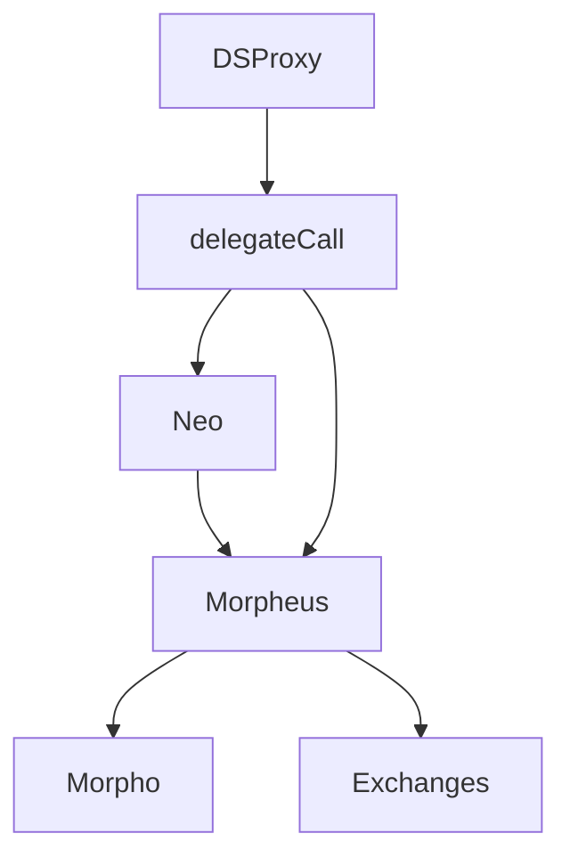

<p align="center"> </p>
<p align="center"> Get out of the Matrix and Leverage your positions using Morpho.</p>


## Installation

Install eth_abi:

```bash
# This is needed in order to run the test. Foundry calls a python script for some test to retrieve Paraswap API calls.
pip install eth_abi
```
Install Foundry:
```bash
# This will install Foundryup
curl -L https://foundry.paradigm.xyz | bash
# Then Run
foundryup
```

Install Dependencies:
```bash
forge install
```

Build:
```bash
forge build
```

Test:
```bash
make test
```

# How it works ?

Morphous gives back the power of flash loans to the people. Each user can access a variety of ways to leverage its position and maximise its rewards.



### Three main components

* `Neo`: Flashloan router. DSProxy delegatecall to this contract in order to take a floashloan.
* `FL`:  Flashloan Recipient. Transfers the flashloaned tokens to DSProxy and execute through Morpheus actions.
* `Morpheus`: Main router that enables to uses Morpho and Aggregators like Paraswap/1nch through DSProxy.
